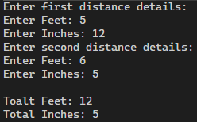

# Structures, array of structures, pointer to structure and usage of multiple files
## 1. Write a C program to compare 2 dates and print appropriate message using structures.

OUTPUT:  

1. 
2. 
3. 

## 2. Write a C program to read students details as given in the table and compute division and print the result, using array of structures.

SL.No Student details
1 Name
2 Roll Number
3 Physics
4 Maths
5 Electronics
6 Problem Solving with C
7 Mechanical
8 Total
9 Average
10 Division(FCD,FC,SC,TC)
11 Result(PASS/FAIL)

Division must be as follows
FIRST CLASS with Distinction:85-100
FIRST CLASS:60-84
SECOND CLASS:50-59
THIRD CLASS:40-49
Print Result : PASS if marks > =40 FAIL if marks <40

OUTPUT:  
1.   

## 3. Write a program to add two distances in inch-feet using structure.

OUTPUT:  
1. 
2. 
# PRACTISE PROGRAMS: 
## 4. Write a program to add, subtract and multiply two complex numbers using structures to function

OUTPUT:  
1. 
2.   

## 5. Write  a  program  for  bill  generator  using  structures  to  read  and  display  each  item along  with  its  unit  price,quantity  purchased  and  the  total  price.And  also  calculate  and print the total cost of all items purchased by the customer.

OUTPUT:  
1. 

