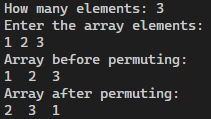
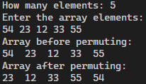
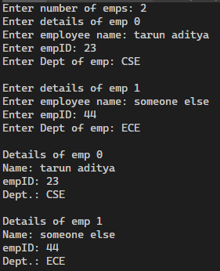
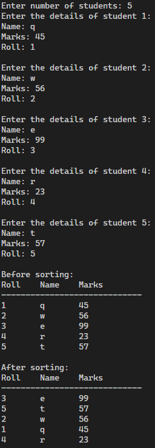
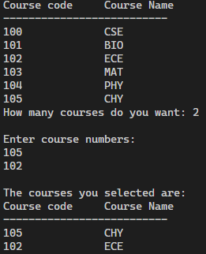
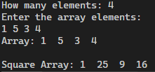

# Dynamic Memory Allocation
## 1. Write a C program to readan array of int as arguments, create a dynamic array to populate cyclically permute the element of an array(In right to left direction).Client will read,display the array and then deallocate the array.Server will have function for read,display and cyclic permutation for array elements.

OUTPUT:  
1. 
2. 

## 2. Write a C program to allocate memory dynamically for the structure called employee.The members of the structure are Emp-id,Name,Department.Client will read and display the structure and then deallocate the structure.Server will have function for read and display employee details.

OUTPUT:  
1. 

## 3. Write a C program to allocate memory dynamically for the structure called student.The members of the structure are rollno(integer), name(string) and marks(integer). Client will read, display and sort the records of the structure student on  the basis of marks in decending order and then deallocate the structure.Use bubble sort for sorting the records.Server will have function for read,display and sort the marks.

OUTPUT:  
1. 

# PRACTISE PROGRAMS

## 4. Write a C program to allocate memory dynamically for the structure called Course.The members of the structure are Coursecode and Coursename. At the begining of the semester student registers for all the 6 courses, later he drops few courses then, reallocate  memory  for  the  given  number  of  courses and register once again from the student. Client will display the courses for the semester after dropping the courses.

OUTPUT:  
1. 

## 5.   Write  a  C  program  to  read  an  array  of  int  as  arguments,  create  a  dynamic  array populate  with  squares  of  elements  in  the  array,  client  will  read  and  display  the  array and then deallocate the array.

OUTPUT:  
1. 
