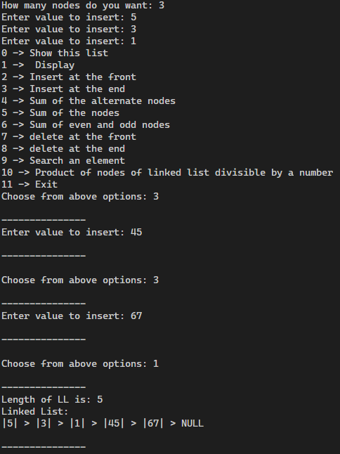
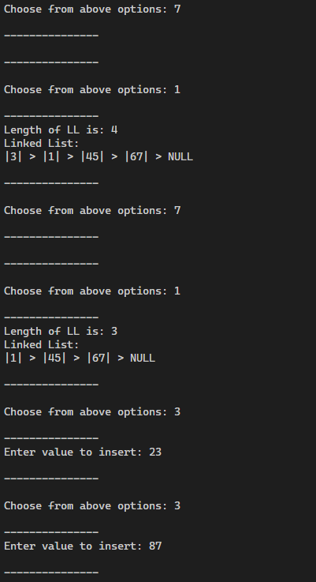
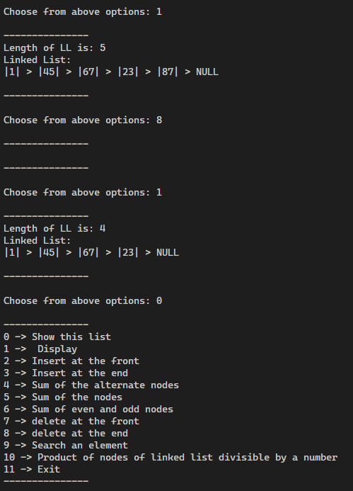
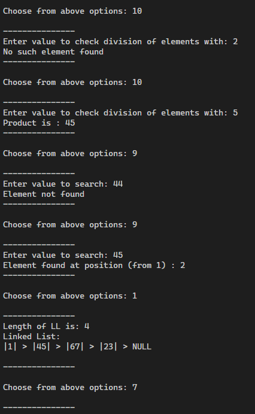
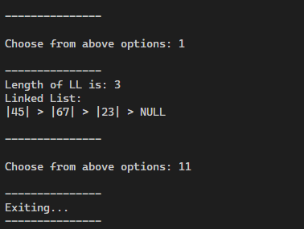
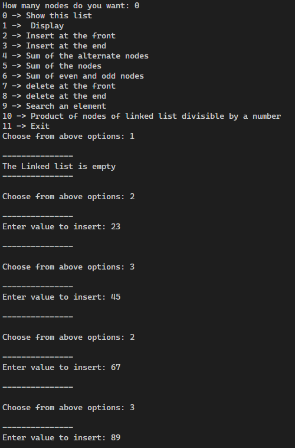
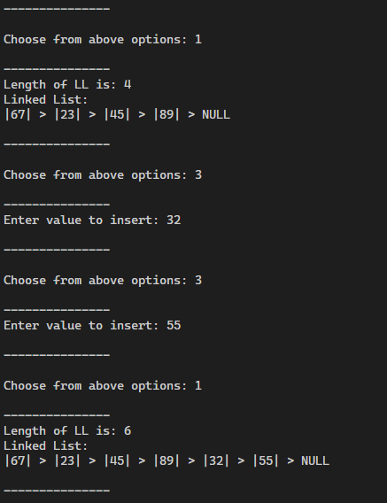
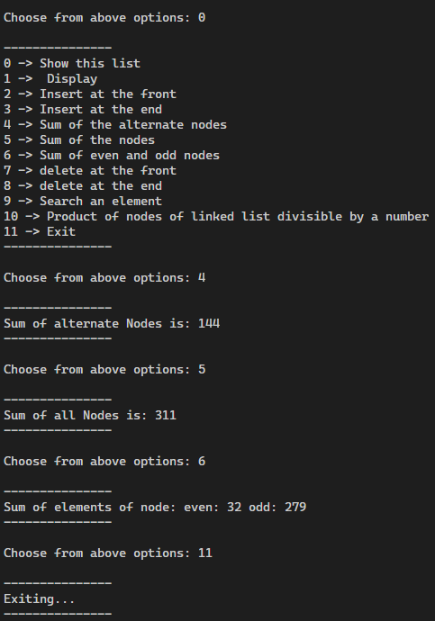

# Students will learn Linked List
> NOTE: The lab and practise program have been merged to form one single linked list management program, since putting both
of them in one program makes it easier to understand the logic involved. Writing separate programs can pave the way for usage
of unfair means (loopholes) 
## 1. Create a singly linked list. Write functions for the following. a) Display b) Insert at the front c) Insert at the end d) Sum of the alternate nodes e) Sum of the nodes f) Sum of even and odd nodes g) delete at the front h)delete at the end i)Search an element j)Product of the nodes of a linked list which are divisible by given number.

### OUTPUT:
### Execution 1:
1. 
2. 
3. 
4. 
5. 

### Execution 2:
1. 
2. 
3. 

>This hasn't been programmed
Practise programs
1) Create a linked list. Write functions for the following.
i)delete at the front
ii)delete at the end
iii)display
iv)Search an element
ii)Product of the nodes of a linked list which are divisible by given number.