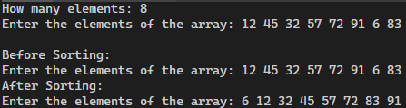

# Students will learn i) insertion sorting technique, usage of array of pointers and also using multiple files. ii) Working with file and different functions used to perform the file operations.
## 1. Write a program to sort positive integers in the ascending order using multiple files.

### OUTPUT:
1. 
2. 

## 2. Write a C program to merge contents of two files into a third file. Hint: Create three files-2 files(file1.txt and file2.txt) with contents and third file(file3.txt) to mergecontents of other two files(file1.txt and file2.txt)
### Executed in CLI:
```
touch file1.txt
echo -e "Good Morning! \nThis is great! \nfile1" > file1.txt
touch file2.txt
echo -e "We love C programming\nfile 2" > file2.txt
touch file3.txt
```

### OUTPUT:
1. 
2. 
3. 
3. 

## 3. Write a C program to write multiple lines in a text file.

### OUTPUT:
1. 

# PRACTISE PROGRAMS:
## 4. Write a C program to replace a specific line in a text file.

### OUTPUT:
1. 

## 5. Write a C program to compare the contents of two files.

### OUTPUT:
1.   

>It's proof that file.txt does not exist!  

2. 
3. 
